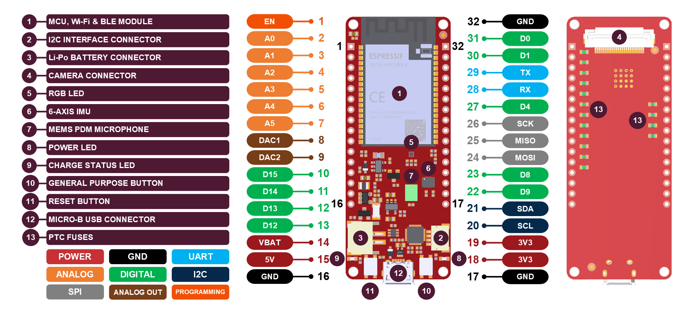
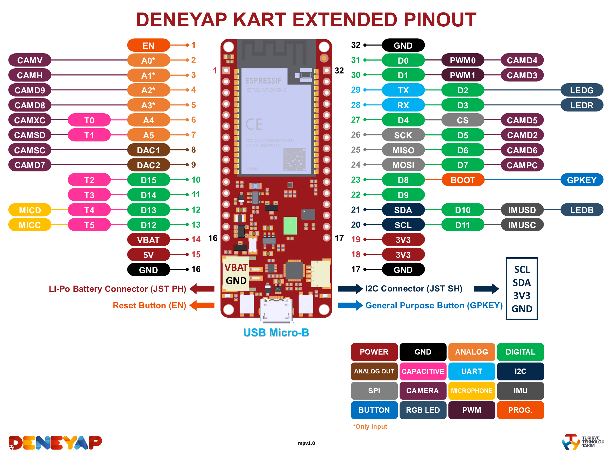
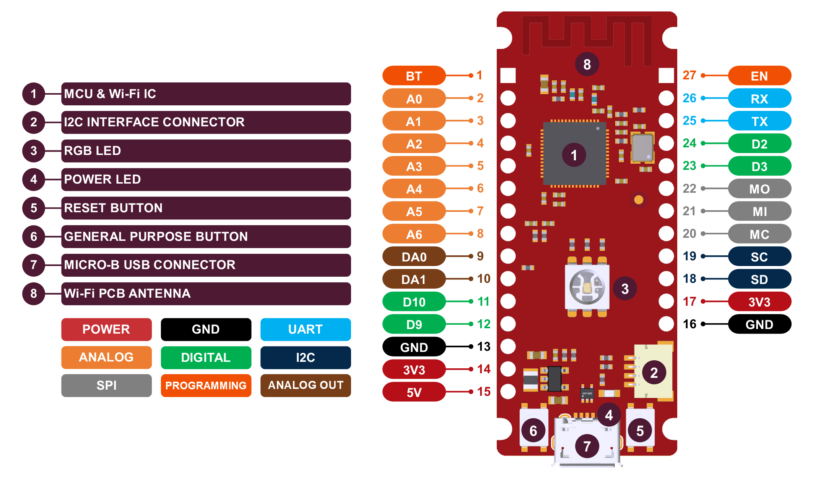
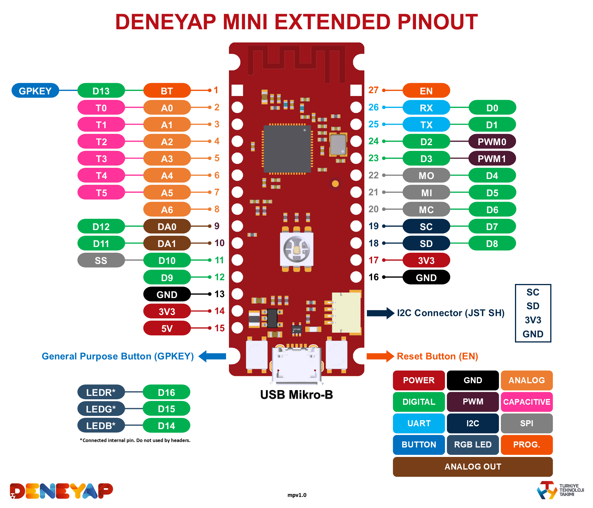
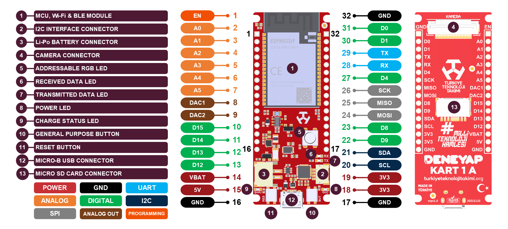
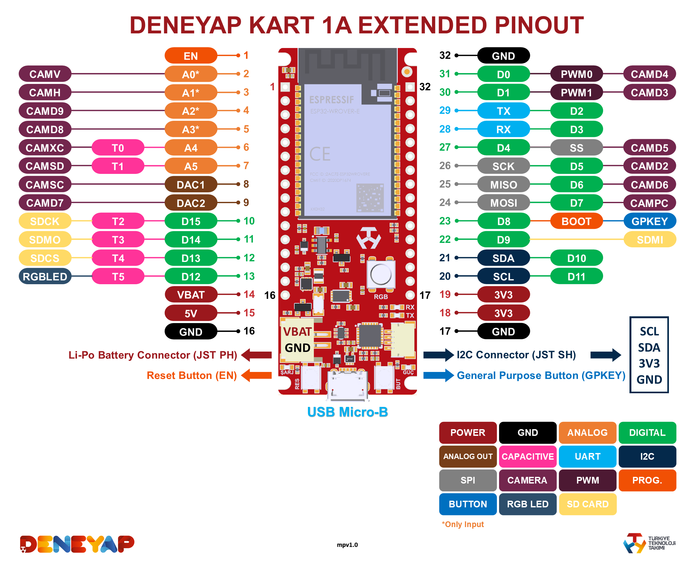
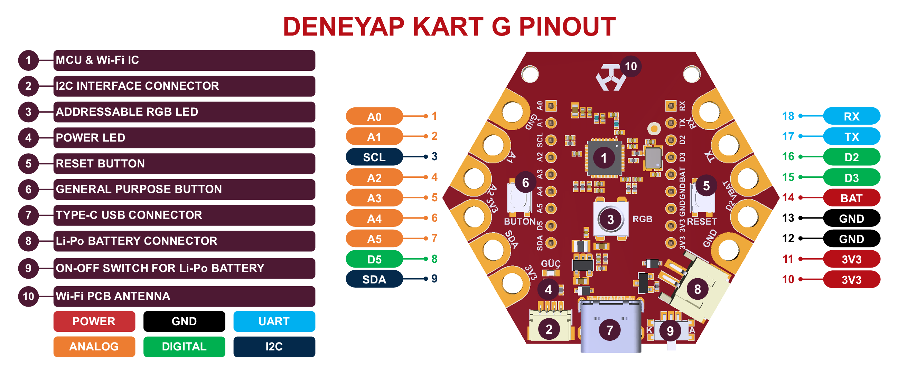
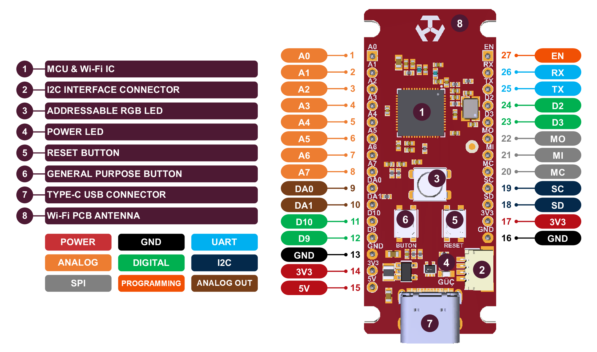
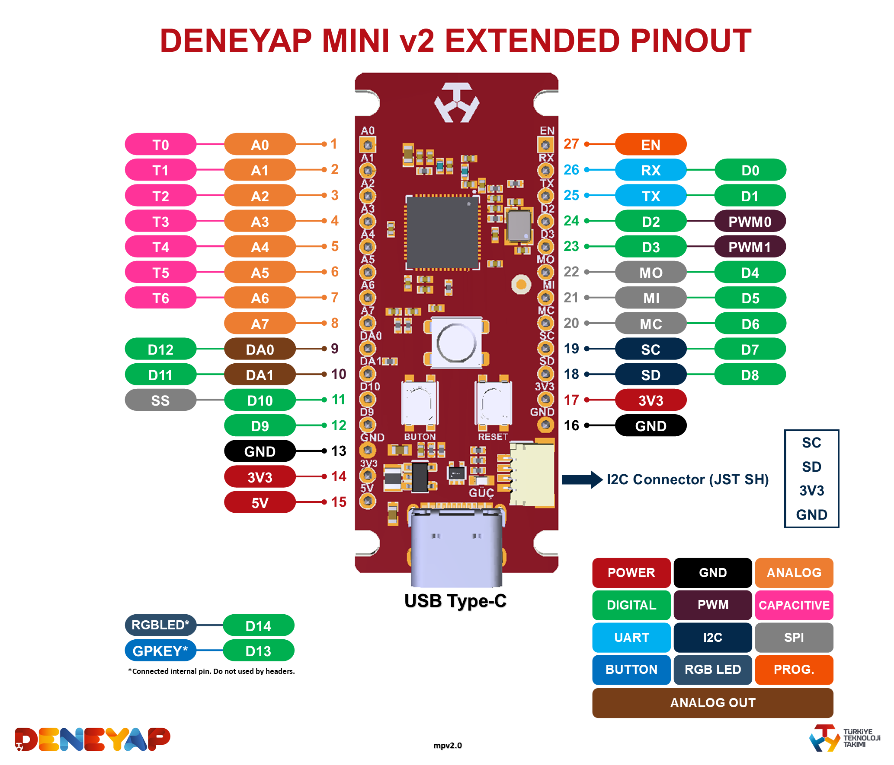

# Deneyap Development Boards Arduino Core
[FOR TURKISH VERSION](docs/README_tr.md) 

  

Need help or have a question? 

Deneyap Kart, designed and manufactured in Turkey, is a powerful development board with its strong MCU, robust design and flexible GPIOs. It allows the users in all levels (beginners to professionals) to create, design and develop projects in the fields of Electronics, Internet of Things (IoT) and Artificial Intelligence (AI).

Deneyap Mini, the tiny member of Deneyap Family, is a little but powerful development board with WiFi capability especially for entry-level makers. It can be easily used for Electronics, Robotics and IoT based applications.

For more information, please visit [Deneyap Kart Technical Guide](https://docs.deneyapkart.org/#deneyap-kart) and [Deneyap Kart Official Website](https://deneyapkart.org).

### Development Status

    

## Contents
- [Installation Instructions](#installation-instructions)
- [Troubleshooting](#troubleshooting)
- [Deneyap Kart Pinout](#deneyap-kart-pinout)
- [Deneyap Mini Pinout](#deneyap-mini-pinout)
- [Deneyap Kart Extended Pinout](#deneyap-kart-extended-pinout)
- [Deneyap Mini Extended Pinout](#deneyap-mini-extended-pinout)
- [Deneyap Kart 1A Pinout](#deneyap-kart-1a-pinout)
- [Deneyap Kart 1A Extended Pinout](#deneyap-kart-1a-extended-pinout)
- [Deneyap Kart G Pinout](#deneyap-kart-g-pinout)
- [Deneyap Kart G Extended Pinout](#deneyap-kart-g-extended-pinout)
- [Deneyap Mini v2 Pinout](#deneyap-mini_v2-pinout)
- [Deneyap Mini v2 Extended Pinout](#deneyap-mini_v2-extended-pinout)

### Installation Instructions
JSON index file: `https://raw.githubusercontent.com/deneyapkart/deneyapkart-arduino-core/master/package_deneyapkart_index.json`

- Install the latest [Arduino IDE](https://www.arduino.cc/en/software).
- Start Arduino IDE and open Preferences window.
- Copy the JSON index file link above into Additional Board Manager URLs field.
- Open Boards Manager from Tools > Board menu and install "Deneyap Gelistirme Kartlari".
- Select Deneyap Kart or Deneyap Kart 1A or Deneyap Mini from Tools > Board menu after installation.

### Troubleshooting
To report any issue/bug/problem etc., please make sure you have searched the similar encountered problems first. After that, if you are sure no on else had the same issue, use the [issue template](.github/ISSUE_TEMPLATE/bug_report.md) while reporting.  

### Deneyap Kart Pinout

### Deneyap Kart Extended Pinout

### Deneyap Mini Pinout

### Deneyap Mini Extended Pinout

### Deneyap Kart 1A Pinout

### Deneyap Kart 1A Extended Pinout

### Deneyap Kart G Pinout

### Deneyap Kart G Extended Pinout

### Deneyap Mini v2 Pinout

### Deneyap Mini v2 Extended Pinout

