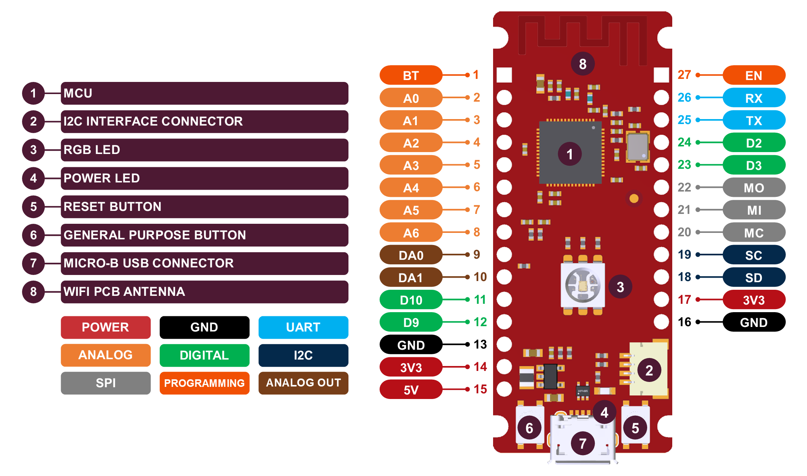

# Deneyap Kart and Deneyap Mini Arduino Core 
[FOR TURKISH VERSION](docs/README_tr.md) 

Deneyap Kart, designed and manufactured in Turkey, is a powerful development board with its strong MCU, robust design and flexible GPIOs. It allows the users in all levels (beginners to professionals) to create, design and develop projects in the fields of Electronics, Internet of Things (IoT) and Artificial Intelligence (AI). 

Deneyap Mini, the tiny member of Deneyap Family, is a little but powerful development board with WiFi capability especially for entry-level makers. It can be easily used for Electronics, Robotics and IoT based applications.

For more information, please visit [Deneyap Kart Technical Guide](https://docs.deneyapkart.org/#deneyap-kart) and [Deneyap Kart Official Website](https://deneyapkart.org).

## Contents
- [Installation Instructions](#installation-instructions)
- [Troubleshooting](#troubleshooting)
- [Deneyap Kart Pinout](#deneyap-kart-pinout)
- [Deneyap Mini Pinout](#deneyap-kart-pinout)

### Installation Instructions
JSON index file: `https://raw.githubusercontent.com/deneyapkart/deneyapkart-arduino-core/master/package_deneyapkart_index.json`

- Install the latest [Arduino IDE](https://www.arduino.cc/en/software). 
- Start Arduino IDE and open Preferences window.
- Copy the JSON index file link above into Additional Board Manager URLs field. 
- Open Boards Manager from Tools > Board menu and install "Deneyap Gelistirme Kartlari".
- Select Deneyap Kart or Deneyap Mini from Tools > Board menu after installation.

### Troubleshooting
To report any issue/bug/problem etc., please make sure you have searched the similar encountered problems first. After that, if you are sure no on else had the same issue, use the [issue template](.github/ISSUE_TEMPLATE/bug_report.md) while reporting.  

### Deneyap Kart Pinout

### Deneyap Mini Pinout
