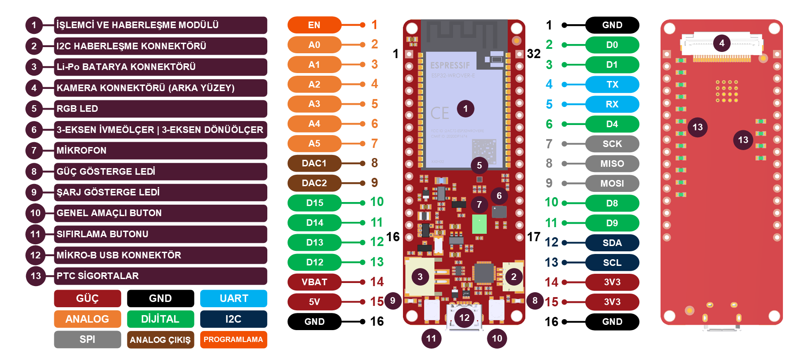
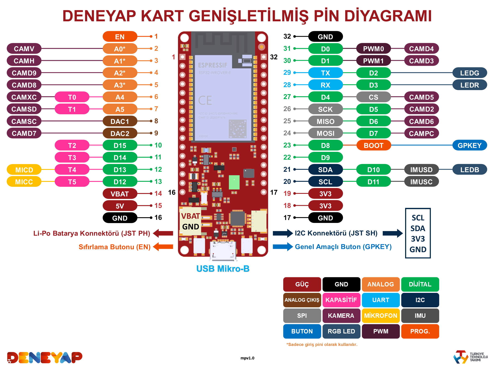
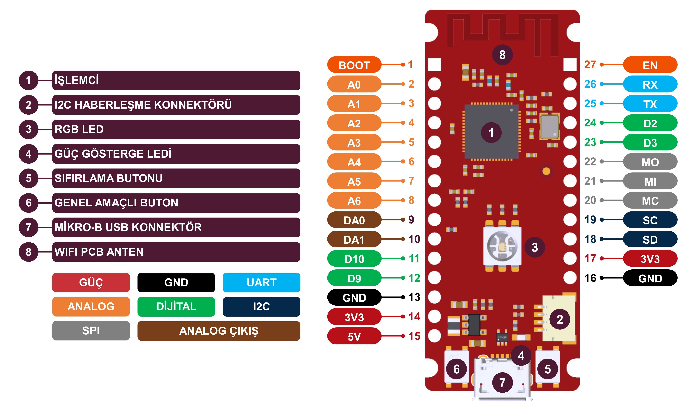
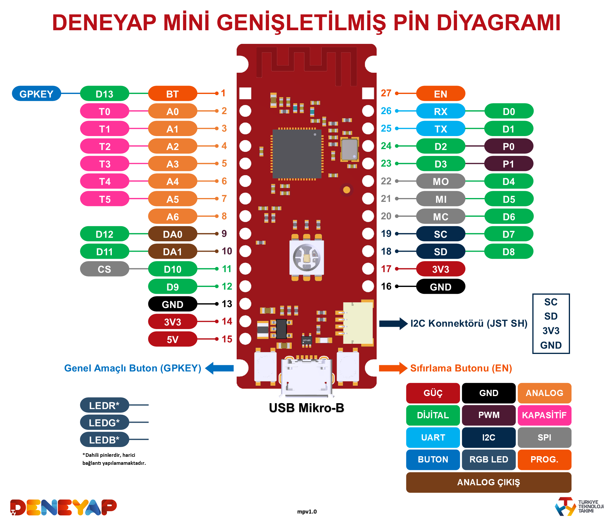
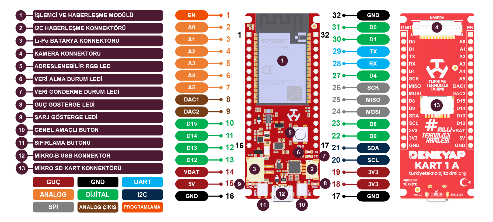
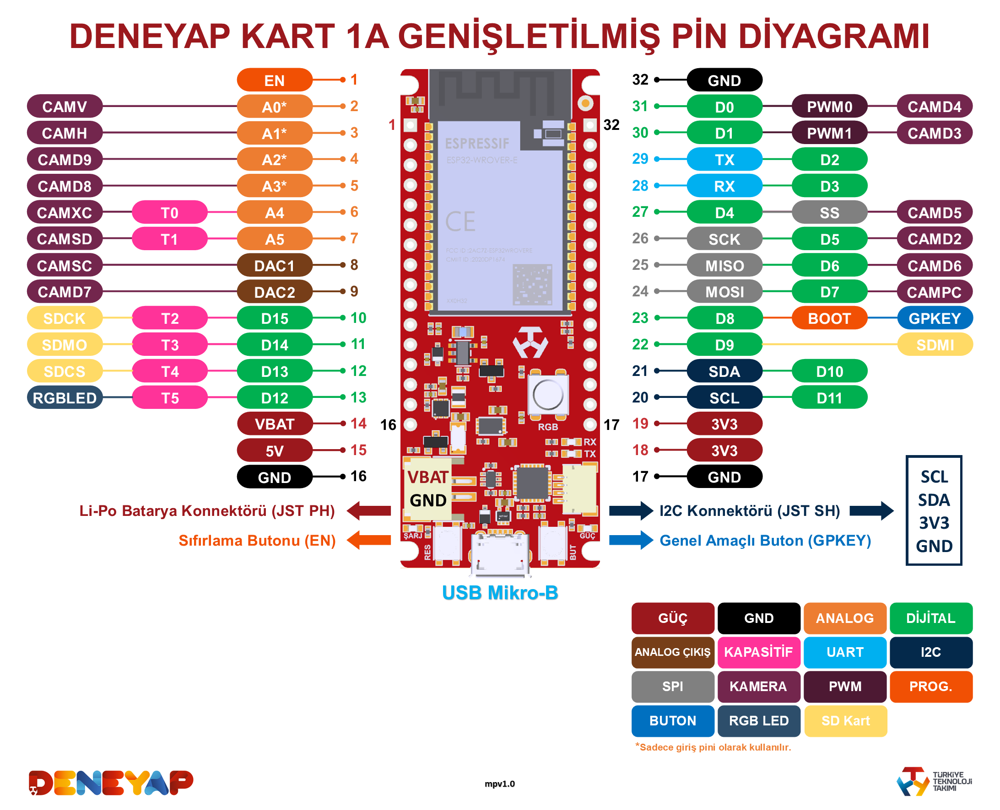

# Deneyap Geliştirme Kartları Arduino Core

  

Yardıma ihtiyacınız var mı veya bir sorunuz mu var? 

Güçlü işlemcisi, dayanıklı tasarımı ve esnek giriş/çıkış pinleri ile Türkiye'de tasarlanıp üretilen Deneyap Kart; Elektronik Programlama, Nesnelerin İnterneti (IoT) ve Yapay Zeka alanlarında başlangıç seviyesinden endüstriyel uygulamalara kadar her seviyede proje geliştirilmesine imkan tanır.

Deneyap Ailesi'nin en küçük üyesi Deneyap Mini, boyutları küçük ama kabiliyetli bir geliştirme kartıdır. Kablosuz haberleşme (WiFi) arayüzüne sahiptir ve özellikle giriş seviyesindeki kullanıcılar için oldukça uygun bir çözüm olarak sunulmuştur. Elektronik, Robotik ve Nesnelerin İnterneti (IoT) projelerinde rahatlıkla kullanılabilir.

Kartlar hakkında detaylı bilgiye erişmek için, lütfen [Deneyap Kart Teknik Rehberi'ni](https://docs.deneyapkart.org/#deneyap-kart) ve [Deneyap Kart Resmi İnternet Sitesi'ni](https://deneyapkart.org) ziyaret ediniz.

### Geliştirme Durumu

    

## İçindekiler
- [Yükleme Talimatları](#yükleme-talimatları)
- [Sorun Giderme](#sorun-giderme)
- [Deneyap Kart Pin Diyagramı](#deneyap-kart-pin-diyagramı)
- [Deneyap Mini Pin Diyagramı](#deneyap-mini-pin-diyagramı)
- [Deneyap Kart 1A Pin Diyagramı](#deneyap-kart-1a-pin-diyagramı)
- [Deneyap Kart Pin Diyagramı](#deneyap-kart-genişletilmiş-pin-diyagramı)
- [Deneyap Mini Pin Diyagramı](#deneyap-mini-genişletilmiş-pin-diyagramı)
- [Deneyap Kart 1A Pin Diyagramı](#deneyap-kart-1a-genişletilmiş-pin-diyagramı)

### Yükleme Talimatları
JSON index dosyası: `https://raw.githubusercontent.com/deneyapkart/deneyapkart-arduino-core/master/package_deneyapkart_index.json`

- Son sürüm [Arduino IDE](https://www.arduino.cc/en/software)'yi yükleyin.
- Arduino IDE'yi başlatın ve **Tercihler** pencerisini açın.
- Yukarıda paylaşılan JSON index dosyasına ait adresi, **Ek Devre Kartları Yöneticisi URL'leri** kısmına yapıştırın.
- **Ayarlar > Kart** adımını takip ederek **Kart Yöneticisi**'ni açın ve *Deneyap Gelistirme Kartlari*'nı yükleyin.
- Yükleme tamamlandıktan sonra, **Ayarlar > Kart** adımından *Deneyap Kart*'ı veya **Deneyap Mini**'yi seçin.

### Sorun Giderme
Herhangi bir hata/sorun bildirmeden önce, lütfen karşılaşılan benzer bir hata/sorun olup olmadığını araştırın. Araştırmanız neticesinde; benzer bir sorunla karşılaşan başka biri olmadığına emin olduğunuz takdirde, [örnek hata bildirme şablonunu](../.github/ISSUE_TEMPLATE/bug_report_tr.md) kullanarak bildirimde bulunabilirsiniz.  

### Deneyap Kart Pin Diyagramı

### Deneyap Kart Genişletilmiş Pin Diyagramı

### Deneyap Mini Pin Diyagramı

### Deneyap Mini Genişletilmiş Pin Diyagramı

### Deneyap Kart 1A Pin Diyagramı

### Deneyap Kart 1A Genişletilmiş Pin Diyagramı
